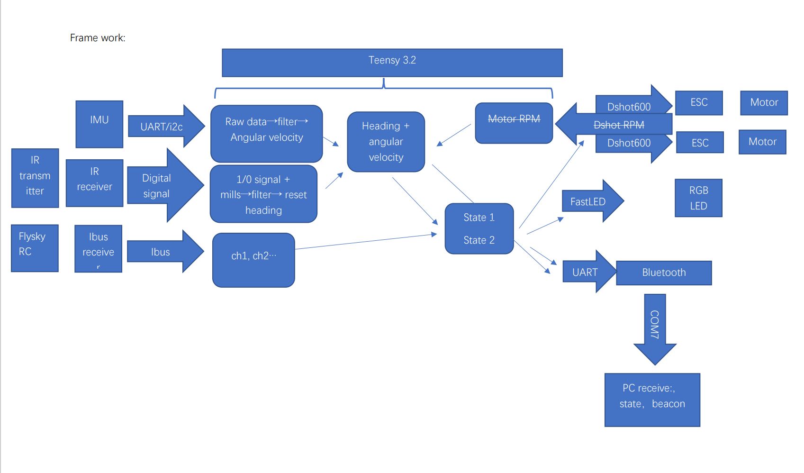
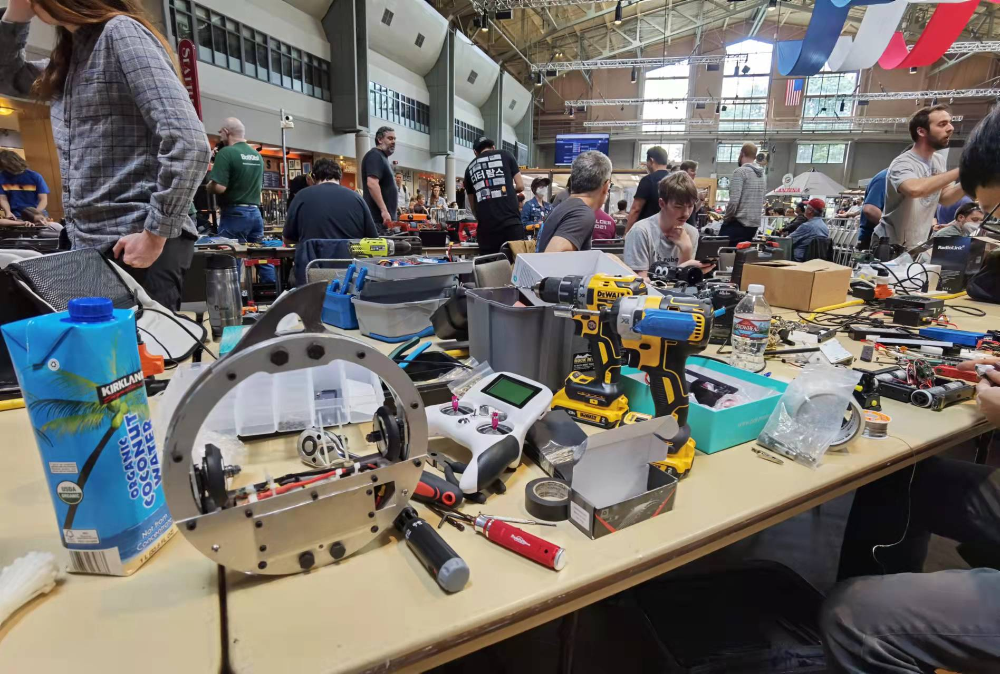
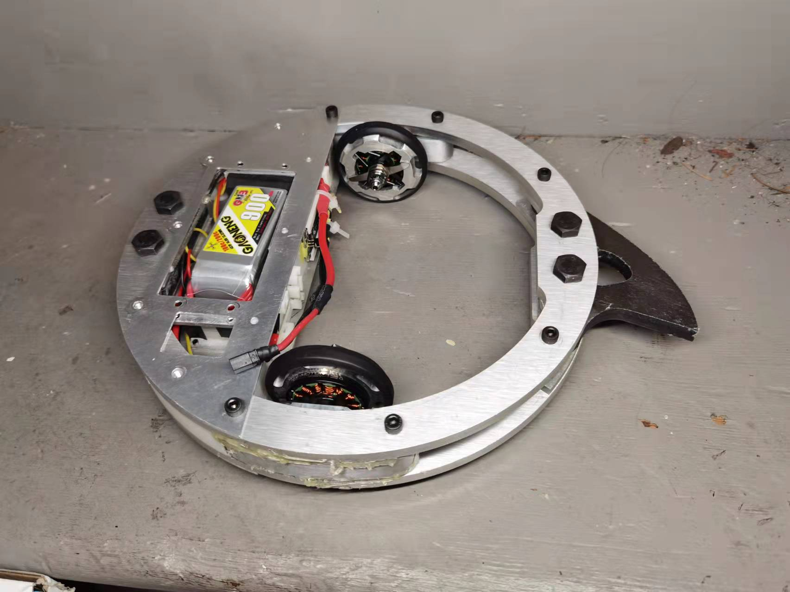

# Meltybrain_Bot_CNMB
Arduino_Coding: codes and header files

[测试和比赛视频（个人B站主页链接）](https://space.bilibili.com/3836113/video)
*************
## 电子设备列表：
* 2810 850kv无刷电机*2或tmotor f90*2
* 飞盈佳乐分体50a电调*2
* Adxl375 200g三轴加速计，串口输出
* CK014红外线接收传感器
* Teensy 3.2 单片机
* FS-RX2A Pro迷你接收机穿越机富斯FLYSKY
* 5v 迷你BEC
* 4xRGBLEDx2
* Tattu 3.0 1300mah 4s

## Electronics：
* 2810 850kv brushless motor *2 or tmotor f90*2
* ESC: 50a*2
* Adxl375 200g IMU
* CK014 IR reciever
* Teensy 3.2 
* Reciever: FS-RX2A Pro FLYSKY
* 5v mini BEC
* LED: 4xRGBLEDx2
* Battery: Tattu 3.0 1300mah 4s

## Control logic：

## Python 曲线拟合：
此部分目的为得到三个系数来校准转速计算公式
横坐标为红外信标所计算出的转速，机器人每转一圈接收一次信标信号，从而推算出转速
纵坐标是加速计测量的加速度，经过Python线性回归拟合点状图

## 比赛现场

