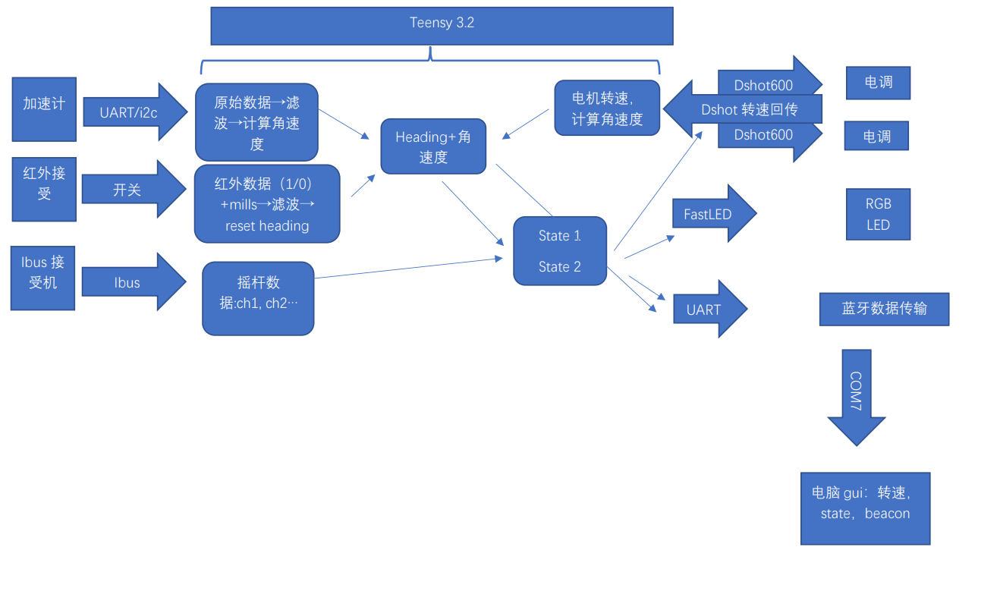

# Meltybrain_Bot_CNMB
Arduino_Coding: codes and header files

[测试和比赛视频（个人B站主页链接）](https://space.bilibili.com/3836113/video)
*************
## 电子设备列表：
* 2810 850kv无刷电机*2或tmotor f90*2
* 飞盈佳乐分体50a电调*2
* Adxl375 200g三轴加速计，串口输出
* CK014红外线接收传感器
* Teensy 3.2
* FS-RX2A Pro迷你接收机穿越机富斯FLYSKY
* 5v 迷你BEC
* 4xRGB LEDx2
* Tattu 3.0 1300mah 4s

比赛现场

